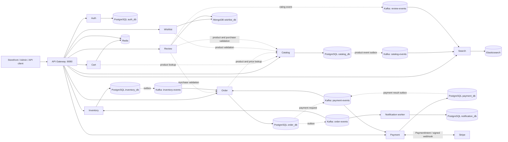

# E-Commerce Platform

An e-commerce backend built from independently deployable services, with a React storefront and admin dashboard in the repository. The platform covers product catalog, carts, inventory, orders, payments, search, wishlists, reviews, and customer notifications.

The API Gateway is the client entry point. Services own their data and use REST for synchronous lookups; Kafka coordinates changes that span checkout and discovery. Checkout is asynchronous: an order is reserved, payment is processed, then the order and inventory are confirmed or released.

## Highlights

- Spring Boot and FastAPI services behind a Spring Cloud Gateway
- JWT access tokens, rotating refresh tokens, and role-based authorization
- Kafka checkout choreography with transactional outboxes in Catalog, Order, Inventory, and Payment
- Order idempotency and database-locked inventory reservation
- Stripe PaymentIntent and signed webhook integration
- Elasticsearch search indexed from catalog and review events
- Redis carts and gateway rate limiting; MongoDB wishlists and reviews
- Docker Compose development stack and Terraform/AWS deployment foundation for Auth Service

## Architecture



### Checkout flow

1. **Order** validates product details and prices with Catalog, stores the order, and publishes `OrderCreated` from its outbox.
2. **Inventory** consumes the event and reserves every line in a database transaction. It publishes either `InventoryReserved` or `InventoryReservationFailed`.
3. On reservation, **Order** publishes `PaymentRequested`. **Payment** creates a Stripe PaymentIntent and records its outcome. Asynchronous outcomes arrive through Stripe’s signed webhook.
4. **Order** confirms or cancels based on the payment result. The resulting order event tells Inventory to commit or release the reservation and tells Notification to send or simulate an email.

These state changes happen asynchronously. Creating an order starts checkout; it does not mean payment and confirmation have completed.

## Services

| Service | Responsibility | Storage | Main communication |
|---|---|---|---|
| API Gateway | Routing, JWT and role checks, CORS, rate limits, circuit breakers | Redis for rate-limit state | REST to backend services |
| Auth | Accounts, access tokens, refresh-token rotation | PostgreSQL `auth_db` | REST; shared HS256 JWTs |
| Catalog | Product reads and admin product management | PostgreSQL `catalog_db` | REST; outbox to `catalog-events` |
| Cart | Per-customer cart with expiry | Redis | REST to Catalog for product details |
| Inventory | Stock and order reservations | PostgreSQL `inventory_db` | REST; consumes `order-events`, publishes `inventory-events` |
| Order | Order lifecycle and checkout orchestration | PostgreSQL `order_db` | REST to Catalog; consumes and publishes Kafka events |
| Payment | Stripe intents and webhook outcomes | PostgreSQL `payment_db` | Consumes and publishes `payment-events`; Stripe webhook |
| Search | Product queries, filters, sorting, and facets | Elasticsearch | Consumes catalog and review events; REST API |
| Wishlist | Customer-saved product references | MongoDB `wishlist_db` | REST to Catalog for validation |
| Review | Verified-purchase reviews and rating summaries | MongoDB `review_db` | REST to Catalog and Order; publishes `review-events` |
| Notification | Order email delivery and deduplication | PostgreSQL `notification_db` | Consumes `order-events`; log or SMTP delivery |

## Key Engineering Decisions

### Transactional outbox

Catalog, Order, Inventory, and Payment store outgoing events with their domain changes, then publish and retry from an outbox worker. This closes the gap where a database commit succeeds but the corresponding Kafka publish fails. Consumers still account for duplicate delivery; the system does not depend on global exactly-once processing.

Review rating updates currently publish directly after the MongoDB write rather than through an outbox. A Kafka outage can delay search rating updates until another review change is published.

### Event-driven checkout

Order, Inventory, and Payment communicate checkout transitions through Kafka so each service can commit its own state and continue independently. Notification consumes the same order lifecycle events. REST remains useful for immediate reads and validation, such as resolving current catalog prices before an order is created.

### Inventory reservation and idempotency

Inventory locks product rows in a stable product-ID order, checks all requested quantities in one transaction, and persists reservation state for later commit or release. Order requires an `Idempotency-Key` and rejects reusing that key for a different request. Stripe requests use an order-scoped idempotency key, and webhook event IDs are stored to deduplicate retries.

### Data ownership and search

Each service owns its database; other services use APIs or events instead of reading its tables. Search is a derived Elasticsearch index updated from catalog and rating events. Product IDs are document IDs, making repeated product events update the same search document.

## Technology Stack

| Area | Technologies |
|---|---|
| Backend | Java 21, Spring Boot 4.1.1, Spring Cloud Gateway (BOM 2025.1.3), Gradle 9.7.1; Python 3.12, FastAPI |
| Messaging | Apache Kafka 3.8.0 |
| Databases | PostgreSQL 16 with Flyway/Alembic; MongoDB 7.0.16 |
| Search and cache | Elasticsearch 8.15.3; Redis 7 Alpine |
| Payments | Stripe Python SDK (`stripe>=11,<15`) |
| Infrastructure | Docker Compose; Terraform >=1.6.0, AWS ECS/Fargate, RDS, ALB, ECR |
| Testing | JUnit 5, Spring test support, H2, pytest |

Python dependency files use version ranges rather than a single lockfile, so resolved library versions depend on the install date.

## Local Development

Docker Compose starts PostgreSQL, MongoDB, Redis, Kafka, Elasticsearch, all backend services, and the API Gateway. It does not start the frontend applications. PostgreSQL databases are initialized from `infra/postgres/init.sql`; service migrations run at startup.

```bash
cp .env.example .env
docker compose --env-file .env -f infra/docker-compose.yml up -d --build
docker compose --env-file .env -f infra/docker-compose.yml ps
```

The Gateway is available at `http://localhost:8080`. Local infrastructure ports are PostgreSQL `5432`, MongoDB `27017`, Redis `6379`, Kafka `9092`, and Elasticsearch `9200`.

Stripe settings in `.env.example` are empty. To complete a test payment, configure Stripe test keys and forward signed webhook events to `/api/payments/webhooks/stripe` through the Gateway. Notifications default to a logged simulation; SMTP is optional.

For the React storefront and admin dashboard, follow [`frontend/README.md`](frontend/README.md) and run their Node.js development commands separately.

Stop the services with:

```bash
docker compose --env-file .env -f infra/docker-compose.yml down
```

Add `-v` only when you intend to remove the local data volumes as well.

## Testing

The Java modules use JUnit 5 with Spring test support; several persistence tests use H2. Python services use pytest. The current Java run passes all **65 tests** across Gateway (13), Auth (8), Catalog (20), Inventory (16), and Order (8). Auth’s context test requires PostgreSQL; the Compose PostgreSQL service was started for that run. Gateway authorization tests load the application CORS configuration.

Python test suites are present, but were not run in this environment because pytest is not installed. No Testcontainers-based suite or full-system end-to-end suite is configured.

Run a Java module’s tests from its directory:

```bash
cd services/order-service && ./gradlew test --no-daemon
```

For Python services with `requirements-dev.txt`, install that file and run `pytest -q` from the service directory. Cart includes pytest in `requirements.txt`.

## AWS / Deployment

Terraform in `infra/terraform/auth-service/` defines the first AWS deployment slice for Auth Service: VPC and subnets, security groups, an HTTP Application Load Balancer, ECS Fargate cluster/task/service, ECR, CloudWatch logs, IAM roles, and PostgreSQL 16 RDS. A GitHub Actions workflow uses OIDC to build and push the Auth image and deploy it to ECS when Auth Service files change on `main`.

Terraform provides the starting point for an Auth Service deployment; its local state is empty, and the repository does not track a live AWS environment. Extending the deployment to the remaining services and data systems is future work.

Before using the workflow for deployment, remove its debug step that prints part of the OIDC token to the job log.

## Project Status

### Implemented

The core service APIs, per-service persistence, authentication, catalog and cart, order idempotency, inventory reservation, event-driven checkout, Stripe webhook path, search indexing, wishlist/reviews, notification worker, and local Compose stack are implemented.

### In Progress

AWS deployment currently has an Auth Service foundation and needs to expand to the rest of the platform. Payment completion requires Stripe credentials and a reachable webhook; local notifications use simulated delivery by default.

### Next

The next milestone is a deployable core beyond Auth Service, with repeatable tests around checkout and event recovery.

## Roadmap

1. Extend the AWS deployment from Auth Service to the remaining backend services.
2. Add a review-event outbox and integration coverage for the order-to-inventory-to-payment flow.
3. Run the Python suites in CI alongside the Java test suites.
