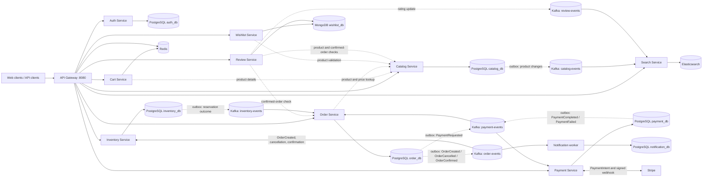

# E-Commerce Platform

A commerce backend built as independently deployable services. Synchronous REST calls handle reads and commands that need an immediate answer; Kafka carries checkout, payment, catalog, and review changes between services. Each service owns its data store, and several event producers use a database outbox so a committed state change can be published after the database transaction.

The code covers the main commerce loop, but external payment delivery and cloud deployment depend on configuration and infrastructure that are not present in this repository. The status below reflects a code and configuration audit on 2026-10-07.

## Architecture



`OrderCreated` reserves stock. An inventory outcome advances the order to payment or cancels it. Stripe outcomes advance the order to confirmed or cancelled; the resulting order event commits or releases the reservation and feeds the notification worker. These are asynchronous transitions, so a successful order-create response does not mean checkout is complete. Stripe requires test or live credentials and a reachable webhook endpoint for payment completion.

## Services

| Service | Responsibility | Storage | Communication |
|---|---|---|---|
| API Gateway | Route APIs, validate JWTs, apply role rules, CORS, Redis rate limits, and configured circuit breakers | Redis for rate-limit state | REST to backend services |
| Auth | Register/login, issue JWT access tokens, rotate and revoke refresh tokens | PostgreSQL `auth_db` | REST; shared HS256 claims validated by the gateway and services |
| Catalog | Product CRUD and product snapshots | PostgreSQL `catalog_db` | REST; outbox to `catalog-events` |
| Inventory | Stock management and order reservations | PostgreSQL `inventory_db` | REST; consumes `order-events`, outbox to `inventory-events` |
| Cart | Per-user cart with expiry and catalog-enriched responses | Redis | REST to Catalog Service |
| Order | Order creation, idempotency, state transitions, and checkout orchestration | PostgreSQL `order_db` | REST to Catalog; outbox and consumers on order, inventory, and payment topics |
| Payment | Stripe PaymentIntents, webhook processing, and payment result events | PostgreSQL `payment_db` | Kafka `payment-events`; signed Stripe webhook |
| Search | Product search, filters, sorting, and facets over a derived index | Elasticsearch | Consumes `catalog-events` and `review-events`; REST search API |
| Wishlist | Customer product saves | MongoDB `wishlist_db` | REST to Catalog for product validation |
| Review | Verified-purchase reviews and per-product rating summaries | MongoDB `review_db` | REST to Catalog and Order; publishes rating updates to `review-events` |
| Notification | Deduplicated order email delivery attempts | PostgreSQL `notification_db` | Consumes `order-events`; log simulation by default or configured SMTP |

The gateway exposes the APIs on `http://localhost:8080`: `/auth/**`, `/api/products/**`, `/api/carts/**`, `/api/inventory/**`, `/api/orders/**`, `/api/payments/**`, `/search`, `/api/wishlist/**`, and product review routes. Notification is an internal worker and has only a health endpoint.

## Key Features

### Authentication and security

- Auth stores BCrypt password hashes and returns short-lived JWT access tokens plus opaque refresh tokens. Refresh tokens are stored as SHA-256 hashes and rotated on use.
- The gateway and each protected service verify the shared HS256 token and enforce customer/admin roles. The gateway provides the main API boundary; service-level checks also exist for most domain APIs.
- CORS origins are configurable. Redis backs gateway request rate limiting. Circuit-breaker fallbacks are configured for gateway routes other than inventory.

### Catalog, cart, and inventory

- Catalog supports paginated product reads and admin product create/update/delete operations.
- Cart entries live in Redis with a configurable TTL. Cart writes use `WATCH`/`MULTI` optimistic concurrency and retry conflicts; returned product data is resolved from Catalog.
- Inventory reservation locks product rows in sorted product-ID order, checks all requested quantities, and records a reservation outcome. Duplicate order events are guarded by reservation state.

### Orders and payments

- Order creation requires an `Idempotency-Key`. Replays with the same request return the existing order; reuse with a different request returns `409`.
- Checkout moves through pending inventory, pending payment, then confirmed or cancelled. Transactional outboxes exist for catalog, order, inventory, and payment events.
- Payment creates an order-scoped Stripe PaymentIntent idempotency key, validates webhook signatures and amount/currency, and records Stripe event IDs to ignore webhook replays.
- Stripe credentials are empty by default in `.env.example`. Without a secret key, requested payments fail and publish a failure result; they do not simulate a successful charge. Orders currently use USD.

### Search, wishlist, reviews, and notifications

- Search builds an Elasticsearch product index from catalog events and supports text search, category/brand/price/rating filters, sorting, pagination, and facets. Review rating updates feed the same index.
- Wishlist writes are scoped to the authenticated user, checked against Catalog, and protected by a unique MongoDB index.
- Reviews require a confirmed order containing the product. One review per customer/product is enforced by a unique index; average rating changes are published to search.
- Notifications consume order confirmation/cancellation events and deduplicate by event ID. The default `log` backend records `SIMULATED` deliveries; SMTP must be configured to send mail.

### Event delivery limits

Outboxes and retry schedules improve delivery across database/Kafka boundaries, but consumers and publishers are designed for duplicate delivery rather than global exactly-once processing. Review rating events are published directly after the MongoDB write, without an outbox; a Kafka outage can leave search ratings stale until another review change publishes an update. The notification worker is configured with a `latest` Kafka offset reset, so a brand-new consumer group does not backfill older order events.

## Technology Stack

Versions below come from build files, container images, or Terraform constraints. Python library requirements are ranges rather than a lockfile, so exact resolved versions vary.

| Area | Technology |
|---|---|
| JVM services | Java 21; Spring Boot 4.1.1; Spring Cloud BOM 2025.1.3; Gradle wrapper 9.7.1 |
| Python services | Python 3.12 container images; FastAPI, SQLAlchemy, PyMongo, and service-specific clients |
| Relational data | PostgreSQL 16; Flyway for Java services; Alembic for Payment and Notification |
| Document and cache | MongoDB 7.0.16; Redis 7 Alpine |
| Messaging and search | Apache Kafka 3.8.0; Elasticsearch 8.15.3 |
| Payments | Stripe Python SDK (`stripe>=11,<15`) |
| Local runtime | Docker Compose |
| AWS definitions | Terraform >=1.6.0 and the HashiCorp AWS provider (provider version is not pinned) |

MongoDB indexes are created by Wishlist and Review at startup. Cart data is stored directly in Redis. No database schema migration is configured for either store.

## Engineering Decisions

- **Own data by service.** Catalog, orders, stock, payments, and notifications each have a separate PostgreSQL database; Wishlist and Review use separate MongoDB databases. Cross-service reads use REST rather than direct table access.
- **Use REST for decisions and Kafka for workflow changes.** Order creation reads current product information synchronously. Reservation, payment, confirmation, cancellation, search indexing, and notifications propagate asynchronously so one request does not synchronously call every service.
- **Use outboxes where a state change must reach Kafka.** Catalog, Order, Inventory, and Payment persist messages alongside their data changes and retry publication. State transitions and provider event IDs make repeat delivery safe at the application level.
- **Protect stock with database locks.** Inventory reserves all order lines inside a transaction using row locks and a stable lock order, then reports one outcome to Order. Reservation records support later commit or release.
- **Make checkout retries explicit.** Order idempotency keys are scoped to a customer and compared against a request hash. Stripe uses an order-scoped idempotency key; signed webhook IDs are persisted for deduplication.
- **Keep search derived.** Elasticsearch consumes events instead of querying Catalog's database. Product IDs are index document IDs; Kafka replay can populate an empty index from retained catalog events.
- **Keep local email safe to run.** Notification defaults to a recorded simulation. SMTP is an explicit configuration choice.

## Local Development

Requirements: Docker with the Compose plugin. The Compose file builds and starts PostgreSQL, MongoDB, Redis, Kafka, Elasticsearch, all ten backend services, and the API Gateway. It does not start either frontend. Service databases are created by `infra/postgres/init.sql`; Flyway and Alembic apply service migrations at startup.

```bash
cp .env.example .env
docker compose --env-file .env -f infra/docker-compose.yml up -d --build
docker compose --env-file .env -f infra/docker-compose.yml ps
```

The included environment file is for local development. For Stripe test payments, set `STRIPE_SECRET_KEY` and `STRIPE_WEBHOOK_SECRET` in `.env`, then configure Stripe to deliver signed events to `/api/payments/webhooks/stripe` through the gateway. SMTP is optional; the default notification backend logs simulated delivery.

The gateway listens at `http://localhost:8080`. Infrastructure ports are PostgreSQL `5432`, MongoDB `27017`, Redis `6379`, Kafka `9092`, and Elasticsearch `9200`. Direct service ports are declared in `infra/docker-compose.yml`; most API calls should go through the gateway.

To stop the stack, run `docker compose --env-file .env -f infra/docker-compose.yml down`. Add `-v` only when you also want to delete the local database, Kafka, Redis, MongoDB, and Elasticsearch volumes.

The React storefront and admin dashboard have separate setup instructions in [`frontend/README.md`](frontend/README.md). They require their own Node.js commands and are not Compose services.

## Testing

Java services use JUnit 5 through the Gradle test task, with Spring test support and H2 for several persistence-focused tests. Python services use pytest. Tests include order idempotency, reservation behavior, JWT handling, service logic, and event compatibility. No Testcontainers dependency or repository-wide integration test suite is configured.

Run Java suites separately from each module directory, for example:

```bash
cd services/order-service && ./gradlew test --no-daemon
```

The other Gradle modules are `api-gateway`, `auth-service`, `catalog-service`, and `inventory-service`. For Python, install each service's `requirements-dev.txt` and run `pytest -q` in that service directory; Cart includes pytest in `requirements.txt` instead.

Audit run on 2026-10-07:

- Java: Catalog 20/20, Inventory 16/16, and Order 8/8 tests passed. Gateway ran 13 tests with 9 failures: the authorization WebFlux slices cannot load because `UrlBasedCorsConfigurationSource` is absent from their test context. Auth ran 8 tests with 1 failure: `contextLoads()` attempted to connect to PostgreSQL at localhost. The other tests in those suites passed.
- Python: all six `python3 -m pytest -q` commands stopped before collection because system Python has no pytest installed. No Python test result is claimed.
- Compose: `docker compose ... config --quiet` passed. No Compose containers were running during the audit, so application startup and end-to-end flows were not verified.

## AWS / Deployment

### Implemented infrastructure

`infra/terraform/auth-service/` defines an AWS VPC and subnets, security groups, an HTTP Application Load Balancer, ECS Fargate cluster/task/service, ECR, CloudWatch logs, IAM roles, and PostgreSQL 16 RDS for **Auth Service only**. `.github/workflows/auth-service.yml` configures an OIDC-based build, image push, and ECS deploy on changes to `services/auth-service/**` on `main`.

### Deployed infrastructure

No live deployment is evidenced by this checkout. The local Terraform state file records zero resources and has no outputs; no AWS deployment was verified. The GitHub Actions workflow is configuration, not evidence that it has run successfully. Terraform values and AWS credentials must be supplied separately.

### Planned infrastructure

The included Terraform does not provision the other services, gateway, Kafka, Redis, MongoDB, Elasticsearch, frontend hosting, or a complete production network. Extending deployment beyond Auth Service and validating the workflow are future work. The current workflow also contains a debug step that prints part of the GitHub OIDC token; remove that before relying on it for deployment.

## Current Status

### Implemented

The service APIs, per-service persistence, JWT authorization, outbox-backed checkout events, inventory reservations, Stripe webhook path, event-fed search, wishlist/review APIs, and notification worker are present in code. Compose defines the full local backend stack.

### Partial

Payment completion needs valid Stripe keys and a reachable webhook. Review-to-search updates have no outbox. Gateway authorization tests and the Auth context-load test currently fail; Python tests were not runnable in this environment. The complete stack was not started for this audit.

### Not Implemented

There is no full AWS deployment definition beyond Auth Service, no Testcontainers suite, and no repository-wide end-to-end verification. `notification-events` appears in architecture notes but is unused; notifications currently consume `order-events`.

### Deployment Status

Local Compose is defined but stopped at audit time. AWS resources are not evidenced as deployed.

## Roadmap

1. Fix the gateway test slice and make Auth's context test self-contained, then add runnable Python test environments.
2. Add an outbox for review rating changes and integration coverage for the full order-to-payment-to-inventory flow.
3. Remove the OIDC token debug step and extend deployment infrastructure beyond Auth Service.
